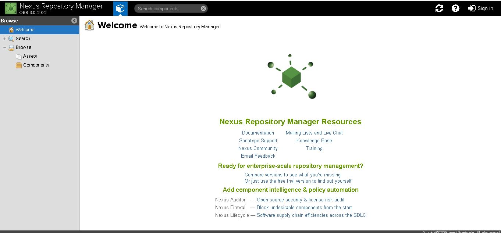
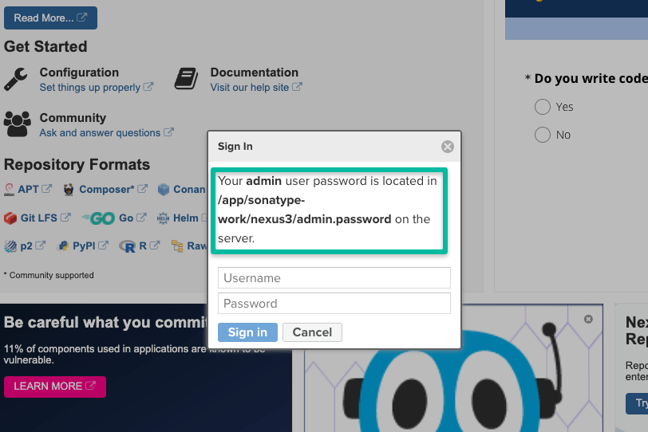

Table of Contents

# Table of Contents
- [Table of Contents](#table-of-contents)
- [How To Install Latest Sonatype Nexus 3 on](#how-to-install-latest-sonatype-nexus-3-on)
  - [Sonatype Nexus System Requirements](#sonatype-nexus-system-requirements)
  - [Sonatype Nexus 3 on Linux ec2 (Redhat Enterprise Linux 7)](#sonatype-nexus-3-on-linux-ec2-redhat-enterprise-linux-7)
- [Automatic Installation](#automatic-installation)
- [Manual Installation](#manual-installation)
  - [Running Nexus as a System Service](#running-nexus-as-a-system-service)
  - [Manage Nexus Service](#manage-nexus-service)
  - [Sonatype Nexus not Starting \[Troubleshooting\]](#sonatype-nexus-not-starting-troubleshooting)
  - [How to check the Nexus version in Linux?](#how-to-check-the-nexus-version-in-linux)
  - [How to start Nexus in Linux?](#how-to-start-nexus-in-linux)


# How To Install Latest Sonatype Nexus 3 on 

Sonatype Nexus is one of the best open-source artifact management tools. It is some tool that you cannot avoid in your CI/CD pipeline. It effectively manages deployable artifacts.

## Sonatype Nexus System Requirements

1. Minimum 1 VCPU & 2 GB Memory
2. Server firewall opened for port 22 & 8081
3. OpenJDK 8
4. All Nexus processes should run as a non-root nexus user.
> Note: For production setup, please consider minimum production hardware requirements based on the nexus usage and data storage. Check out the [official system requirements document](https://help.sonatype.com/repomanager3/installation/system-requirements) for detailed information

## Sonatype Nexus 3 on Linux ec2 (Redhat Enterprise Linux 7)

This article guides you to install and configure Sonatype Nexus 3 in a secure way on an ec2 Linux System.

> **Note:** This was tested on a Redhat machine and it will work on Centos or related Linux flavors as well.

# Automatic Installation

**Step 1:** Login to your Linux server 
**Step 2:** Install git and clone this repository.
**Step 3:** Change directory to the cloned repository and run the installation script as root user.

```console
sudo yum install git -y
git clone https://github.com/phitabs24/nexus-install-scripts.git
cd nexus-install-scripts
sudo bash nexus-install-redhat.sh
```


# Manual Installation

**Step 1:** Login to your Linux server and update the yum packages. Also install required utilities.

```console
sudo yum update -y
sudo yum install wget -y
```

**Step 2:** Install OpenJDK 1.8

```console
sudo yum install java-1.8.0-openjdk.x86_64 -y
```
**Step 3:** Create a directory named app and cd into the directory.

```console
sudo mkdir /app && cd /app
```
**Step 4:** Download the latest nexus. You can get the latest download links fo for nexus [from here](https://help.sonatype.com/repomanager3/download).

```console
sudo wget -O nexus.tar.gz https://download.sonatype.com/nexus/3/latest-unix.tar.gz
```
Untar the downloaded file.

```console
sudo tar -xvf nexus.tar.gz
```
Rename the untared file to nexus.

```console
sudo mv nexus-3* nexus
```

**Step 5:** As a good security practice, it is not advised to run nexus service with root privileges. So create a new user named nexus to run the nexus service.

```console
sudo adduser nexus
```

Change the ownership of nexus files and nexus data directory to nexus user.

```console
sudo chown -R nexus:nexus /app/nexus
sudo chown -R nexus:nexus /app/sonatype-work
```
**Step 6:** Open `/app/nexus/bin/nexus.rc` file

```console
sudo vi  /app/nexus/bin/nexus.rc
```
Uncomment `run_as_user` parameter and set it as following.

```console
run_as_user="nexus"
```
**Step 7:** If you want to change the default nexus data directory, open the nexus properties file and change the data directory `-Dkaraf.data` parameter to a preferred location as shown below. If you don’t specify anything, by default nexus data directory will be set to `/app/sonatype-work/nexus3`

> Tip: For production setup, it is is always better to mount the nexus data directory to a separate data disk attached to the server. So that backup and restore can be done easily.

```console
sudo vi /app/nexus/bin/nexus.vmoptions
```
An example configuration is shown below.

```console
-Xms2703m
-Xmx2703m
-XX:MaxDirectMemorySize=2703m
-XX:+UnlockDiagnosticVMOptions
-XX:+UnsyncloadClass
-XX:+LogVMOutput
-XX:LogFile=../sonatype-work/nexus3/log/jvm.log
-XX:-OmitStackTraceInFastThrow
-Djava.net.preferIPv4Stack=true
-Dkaraf.home=.
-Dkaraf.base=.
-Dkaraf.etc=etc/karaf
-Djava.util.logging.config.file=etc/karaf/java.util.logging.properties
-Dkaraf.data=/nexus/nexus-data
-Djava.io.tmpdir=../sonatype-work/nexus3/tmp
-Dkaraf.startLocalConsole=false
```
## Running Nexus as a System Service
It is better to have `systemd` entry to manage nexus using `systemctl`. Follow the steps given below for adding nexus as a `systemd` service.

Create a nexus `systemd` unit file.

```console
sudo vi /etc/systemd/system/nexus.service
```
Add the following contents to the unit file.

```console
[Unit]
Description=nexus service
After=network.target

[Service]
Type=forking
LimitNOFILE=65536
User=nexus
Group=nexus
ExecStart=/app/nexus/bin/nexus start
ExecStop=/app/nexus/bin/nexus stop
User=nexus
Restart=on-abort

[Install]
WantedBy=multi-user.target
```
## Manage Nexus Service
Now we have all the configurations in place to run nexus.

Execute the following command to add nexus service to boot.

```console
sudo chkconfig nexus on
```
To start the Nexus service, use the following command. If you are having trouble starting nexus, please check the troubleshooting section below.

```console
sudo systemctl start nexus
```
The above command will start the nexus service on port `8081`. To access the nexus dashboard, visit http://:8081. You will be able to see the nexus homepage as shown below.



To log in, use the default username and password.

Default username is `admin`

You can find the default admin password in `/app/sonatype-work/nexus3/admin.password` file. The path will be shown in the login screen as show below.



```console
cat /app/sonatype-work/nexus3/admin.password
```
Once you login, you will be prompted to reset the password.

For stopping nexus, execute

```console
sudo systemctl stop nexus
```
For restarting nexus,

```console
sudo systemctl restart nexus
```
## Sonatype Nexus not Starting [Troubleshooting]
Sometimes, if the server is enabled with SELINUX, you might get the following error. (Commonly on Centos Servers)

> Job for nexus.service failed because the control process exited with error code.
See "systemctl status nexus.service" and "journalctl -xe" for details.
Execute the following command and see the actual error.

```console
journalctl -xe
```
Check the output for the following SELINUX issue.

```console
SELinux is preventing /usr/lib/systemd/systemd from execute access on the file nexus.
```
To rectify this issue, add a SELinux policy to allow Systemd to access the nexus binary in path `/app/nexus/bin/nexus` using the following command.

```console
sudo chcon -R -t bin_t /app/nexus/bin/nexus
```
Now, start the Nexus server again.

```console
sudo systemctl start nexus
```
## How to check the Nexus version in Linux?
You can find the Nexus version from the Dashboard. Also, if you want to find the version from the Linux command line, execute the following command.
```console
curl --include --silent http://localhost:8081/ | grep Server
```
## How to start Nexus in Linux?
Nexus binary comes as an executable. You can use the binary path to start nexus. For background execution, you can create a `systemd` file with nexus configurations.
